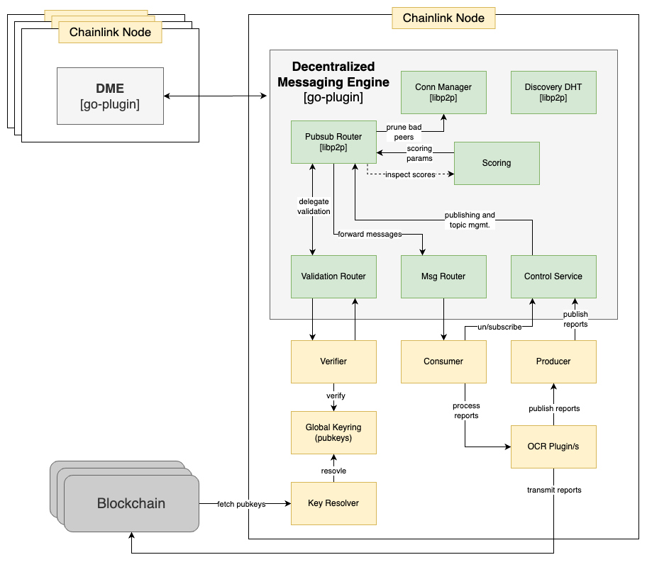

# Cross DON Communication with a Decentralized Event Engine

This document describes an alternative solution for DON2DON interaction, to address composition DON goals.


## Table of Contents

- [Abstract](#abstract)
- [Introduction](#introduction)
- [Background](#background)
- [Protocol Overview](#protocol-overview)
    - [Agents](#agents)
    - [Network Topology](#network-topology)
    - [Message Validation](#message-validation)
- [High Level Design](#high-level-design)
- [Security](#security)
    - [Threat Analysis](#threat-analysis)
- [Appendix: libp2p](#appendix-libp2p)
    - [Security](#security-1)
    - [Pubsub](#pubsub)
        - [Key Concepts of Gossiping](#key-concepts-of-gossiping)
        - [How Gossipsub Works](#how-gossipsub-works)
    - [Kad DHT](#kad-dht)

## Abstract

Decentralized Messaging Engine (DME) is a protocol designed to facilitate interoperability between separate decentralized oracle networks (DONs). It allows nodes to securely exchange verifiable messages cross DONs, enabling the formation of a collaborative **overlay networks**. The protocol leverages [libp2p](https://docs.libp2p.io/) and gossipsub ([v1.1](https://github.com/libp2p/specs/blob/master/pubsub/gossipsub/gossipsub-v1.1.md)) for robust networking and message propagation while ensuring the integrity and authenticity of transmitted data through an outsourced cryptographic and sequence validation.

## Introduction

The proliferation of oracle networks has led to isolated data silos, hindering efficient cross-network communication and collaboration.
To address this issue, we introduce a decentralized messaging engine designed to interconnect separate DONs securely.

Standalone DONs that connects via the engine, forms a global network that is consist of multiple overlay networks, for sharing verifiable data that was originated within the publishing DON.

Introducing DON2DON communication enables to re-architect Chainlink core services and products to have a more modular, interoperable and extensible design to achieve composition DON goals.

### Goals

- Enable secure communication layer cross DONs
- Ensure the validity and authenticity of exchanged messages
- Utilize libp2p and gossipsub for efficient networking and message propagation
- Provide a flexible and scalable API for various OCR plugins

## Background

Libp2p is a modular networking framework designed for peer-to-peer communication in decentralized systems. It provides a foundation for building decentralized applications and systems by offering a range of essential components. Among its core features are [pubsub](https://www.notion.so/Cross-DON-Communication-with-a-Decentralized-Event-Engine-e7051e6ba4c1436ea4846e00e3c0adc2?pvs=21), [peer discovery](https://www.notion.so/Cross-DON-Communication-with-a-Decentralized-Event-Engine-e7051e6ba4c1436ea4846e00e3c0adc2?pvs=21), abstracted transport layer and a complete [cryptography suite](https://www.notion.so/Cross-DON-Communication-with-a-Decentralized-Event-Engine-e7051e6ba4c1436ea4846e00e3c0adc2?pvs=21).
To summarize, libp2p provides a battle tested, complete yet extensible networking solution for a distributed message engine.

**NOTE:** For more information see the [appendix](https://www.notion.so/Cross-DON-Communication-with-a-Decentralized-Event-Engine-e7051e6ba4c1436ea4846e00e3c0adc2?pvs=21).

[gossipsub v1.1](https://github.com/libp2p/specs/blob/master/pubsub/gossipsub/gossipsub-v1.1.md) is a dynamic and efficient message propagation protocol, it is based on randomized topic meshes and gossip, with moderate amplification factors and good scaling properties.

Gossipsub is designed to be extensible by more specialized routers, and provides an optimized environment for a distributed protocol that runs over a trust-less p2p network.

## Protocol Overview

In high level, agents runs within a CL node, and enables the node to gossip messages in an overlay network (topic), with a decoupled message validation to avoid introducing additional dependencies for the agent e.g. public keys, persistent storage of reports, etc.

Gossiping verified OCR reports enables to achieve optimal latency and throughput because there is no additional signing involved, consensus is not needed for sharing a sequential, signed-by-quorum set of public reports.

Message validation is decoupled from the agent, which queues messages for validation and processing, and enables to implement a custom validation logic within the node itself. In our case, we are validating that a given report was originated by some DON, where at least a quorum of nodes have confirmed it. And that the sequence number is accurate to some degree, to avoid bad actors that sends unrealistic sequence numbers, but still allow some flexibility for nodes that are not synced with the latest sequence number, as long as they are not too far behind.

Based on validation results, message rate and overall behaviour, peer scoring is being facilitated by the pubsub router, but requires network specific settings to fit the topology, expected message rate and the strictness of our validation.

### Agents

Agents are separate processes running within each oracle node, exposing a gRPC API for interaction. They facilitate message validation and secure communication with other oracle nodes.

```protobuf
service ControlService {
    rpc Publish(PublishRequest) returns (PublishResponse); 
    rpc Subscribe(SubscribeRequest) returns (SubscribeResponse);
    rpc Unsubscribe(UnsubscribeRequest) returns (UnsubscribeResponse);
}

service MsgRouter { 
    rpc Listen(ListenRequest) returns (stream Message) {}
}

service ValidationRouter { 
    rpc Handle(stream Message) returns (stream ValidatedMessage) {}
}
```

### Network Topology

Standalone oracles that connects via the engine, forms a global network that is consist of multiple overlay networks, for sharing verifiable data that was originated within the oracles.

Each oracle creates an overlay network (AKA topic) for outbound traffic, where other oracles can join and subscribe for messages.

:bulb: **NOTE:** There might be multiple overlays for the same oracle, depends on versioning and business logic.

TODO: diagram

### Message Validation

All the messages that propagates through the pipes must be valid, by the following strict rules:

- The message was **signed by a quorum** of oracle-network nodes
- The message has a **sequence number** that match the corrent order

As the validation is delegated the parent node, we rely on the security properties of an existing infra for signing and verifying messages.

:bulb: **NOTE:** Having validation within the agent introduces complexity and vulnerabilites.

## High Level Design

[TODO: extend]

The following diagram describes the architecture of an agent integrated within a CL node:



[TODO: extend on components on the node side]

## Security

### Threat Analysis

We aim to create a robust and secure messaging protocol for cross oracle network interoperability, by considering the following threats and the corresponding mitigation strategies:

### Message Spamming

Attackers flood the network with invalid or malicious messages, consuming bandwidth and degrading network performance.

**Severity:** Very high 
**Impact:** Network congestion, performance degradation, resource exhaustion.

**Mitigation strategy:**

- Require message validation with cryptographic signatures to ensure message authenticity and integrity
- Require message sequence validation, where unrealistic sequences are considered invalid
- Use caching, where the key is based on content hashing, so the same message won't exhaust resources.

### Message Spamming: Validation Queue Flooding

Attackers can overload the validation queue by sending spam messages at a very high rate. Legitimate messages get dropped, resulting in a denial of service as messages are ignored.

**Severity:** Very high
**Impact:** Denial of service, message loss.

**Mitigation strategy:**
Implement a circuit breaker before the validation queue that makes informed decisions based on message origin IP and a probabilistic strategy to drop messages. See [gossipsub v1.1: validation-queue-protection](https://github.com/libp2p/specs/blob/master/pubsub/gossipsub/red.md#gossipsub-v11-functional-extension-for-validation-queue-protection).

### Censorship Attacks

Malicious nodes selectively block messages to suppress certain information. Countermeasures include redundancy and diversification of message propagation paths.

**Severity:** Very high
**Impact:** Information suppression, network manipulation.

**Mitigation Strategies:**

- Maintain a diverse set of mesh peers to maintain network resilience
- Use redundancy in message propagation paths to counter censorship attacks
- Employ mechanisms to detect and mitigate Sybil nodes, such as peer scoring and validation

### Denial of Service (DoS)

Adversaries flood the network with malicious traffic or connections to disrupt its operation.

**Severity:** High
**Impact:** Network disruption, resource exhaustion.

**Mitigation strategy:**
Implement rate limiting, connection policies, and adaptive firewall mechanisms to protect against DoS attacks.

### Partition Attacks

Adversaries attempt to partition the network by disrupting communication between mesh peers.

**Severity:** High
**Impact:** Network fragmentation, reduced communication.

**Mitigation Strategy:**
Ensuring a diverse set of well-behaved mesh peers can help prevent this.
Implement a robust peer scoring system to detect and disconnect poorly performing or malicious peers. See [gossipsub v1.1: peer scoring](https://github.com/libp2p/specs/blob/master/pubsub/gossipsub/gossipsub-v1.1.md#peer-scoring).

### Sybil Attacks

Attackers create multiple fake identities (Sybil nodes) to manipulate the network.

**Severity:** Medium
**Impact:** Potential network manipulation, disruption.

**Mitigation strategy:**
Relies on the effectiveness of peer discovery mechanisms, including whitelisting which in controlled by the parent node, which should have access to that information.

### Eclipse Attacks

Malicious nodes attempt to control a target node's connections, isolating it from the legitimate peers.

**Severity:** Medium
**Impact:** Network isolation, potential data manipulation.

**Mitigation strategy:**
Ensure diverse connectivity by utilizing peer discovery methods and continuously change connected peers.

### DHT Pollution

Malicious nodes flood the DHT with malicious entries as part of an eclipse attack or irrelevant data, potentially disrupting the network's ability to perform efficient content retrieval (NOTE: in case the DHT will be used for storage in addition to discovery).

**Severity:** Medium
**Impact:** Network isolation, degraded performance in content retrieval, network congestion, resource exhaustion.

**Mitigation Strategies:**

- Implement DHT security mechanisms to prevent unauthorized writes and ensure data validity
- Regularly check the integrity of DHT data and remove or quarantine polluted entries
- Implement rate limiting and access controls for DHT writes to mitigate pollution attempts.

## Appendix: libp2p

The following libp2p protocols are used by the agent:

| Name | Description | Links |
| --- | --- | --- |
| Gossipsub (v1.1) | Pubsub messaging | https://github.com/libp2p/specs/blob/master/pubsub/gossipsub/gossipsub-v1.1.md |
| Kad DHT | Distributed hash table for discovery | https://github.com/libp2p/specs/tree/master/kad-dht |
| Noise | Protocol for securing transport | https://github.com/libp2p/specs/blob/master/noise/README.md |
| Yamux | Protocol for multiplexing transport | https://github.com/libp2p/specs/blob/master/yamux/README.md |

### Security

Libp2p provides strong cryptographic support, including secure key management and encryption. It offers options for transport-level encryption and authentication, ensuring the confidentiality and integrity of data exchanged between peers.

Secure channels in libp2p are established with the help of a transport upgrader, which providers layers of security and stream multiplexing over "raw" connections such as TCP sockets.

### Pubsub

### Key Concepts of Gossiping

1. **Fanout Groups:** In a gossip-based network like Gossipsub, peers are organized into "fanout groups" based on their interests, i.e., the topics they subscribe to. Each fanout group represents a set of peers interested in the same topic. Messages are gossiped within these fanout groups to ensure that relevant information reaches its intended audience efficiently.
2. **Mesh Peers:** Within each fanout group, a subset of peers forms a "mesh." The mesh represents a more tightly connected subgroup where every member is directly connected to every other member. Messages are initially sent to mesh peers, who play a crucial role in the efficient propagation of messages within their fanout group.
3. **Message Propagation:** Gossiping relies on a "gossip" mechanism where mesh peers share messages they have received with other mesh peers within the same fanout group. This propagation method ensures that messages quickly spread to all members of the group without overloading the network with redundant copies. Gossiping reduces the number of messages sent while maximizing their reach.
4. **Heartbeat Interval:** Gossipsub introduces a "heartbeat" mechanism that defines a regular interval at which peers exchange heartbeat messages with their mesh peers. Heartbeats help maintain the freshness of the mesh and enable the discovery of new topics or subscriptions. During heartbeats, peers can also inform each other about their latest state, including the topics they are interested in.
5. **Peer Scoring:** Gossipsub incorporates a "peer scoring" mechanism to evaluate the behavior and trustworthiness of network peers. Peers are assigned scores based on various factors, including their message forwarding reliability, responsiveness, and adherence to protocol rules. Low-scoring peers may be disconnected from the network to maintain its health and reliability.
6. **Message Validation:** To maintain the integrity and authenticity of messages, Gossipsub requires that all messages be signed by their publishers. Upon receiving a message, nodes validate its signature to ensure it has not been tampered with during transmission. Invalid messages are promptly discarded to prevent the spread of misinformation.
7. **Pruning:** To further optimize the network's efficiency, Gossipsub employs a "pruning" mechanism. This mechanism removes peers from the mesh and fanout groups when they are no longer interested in a particular topic. Pruning ensures that resources are allocated efficiently, and peers focus on propagating messages relevant to their subscriptions.

### How Gossipsub Works

- **Message Exchange:** When a node wishes to publish a message to a topic, it first sends the message to its mesh peers within the corresponding fanout group. Mesh peers validate the message and, if valid, forward it to their mesh peers and so on. Messages propagate through the mesh until they reach all mesh peers within the group.
- **Heartbeat:** Each peer runs a periodic stabilization process called the "heartbeat procedure"
at regular intervals (1s is the default). The heartbeat serves three functions: 
1. [mesh maintenance](https://github.com/libp2p/specs/blob/master/pubsub/gossipsub/gossipsub-v1.0.md#mesh-maintenance) to keep mesh fresh and discover new subscriptions
2. [fanout maintenance](https://github.com/libp2p/specs/blob/master/pubsub/gossipsub/gossipsub-v1.0.md#fanout-maintenance) to efficiently adjust fanout groups based on changing interests
3. [gossip emission](https://github.com/libp2p/specs/blob/master/pubsub/gossipsub/gossipsub-v1.0.md#gossip-emission) to a random selection of peers for each topic (that are not already members of the topic mesh)
- **Piggybacking:** Gossipsub employs [piggybacking](https://github.com/libp2p/specs/blob/master/pubsub/gossipsub/gossipsub-v1.0.md#control-message-piggybacking) - a technique where acknowledgment (ACK) messages carry new messages. When a peer sends an ACK for a message, it may include new messages it has received. This optimizes bandwidth usage by combining acknowledgment and message propagation in a single step.

To summarize, `gossipsub` leverages a combination of fanout groups, mesh peers, message propagation, heartbeat intervals, peer scoring, message validation, and piggybacking to efficiently distribute messages within decentralized networks. These mechanisms ensure that messages reach their intended recipients while maintaining network health and minimizing redundancy.

### Kad DHT

[KadDHT](https://github.com/libp2p/specs/tree/master/kad-dht) is used for peer discovery. It requires to deploy a set of bootsrapper nodes, which are used by new peers to join the network.

**NOTE:** bootstrappers should managed by multiple parties for decentralization.