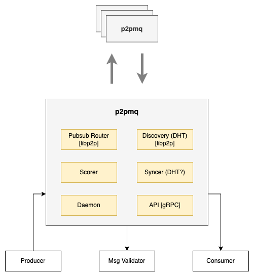

# p2pmq

`p2pmq` is a distributed, permissionless message queue.

A group of `p2pmq` peers forms a standalone network for 
broadcasting messages over topics.

## Overview

A network of `p2pmq` agents is capable of the following:
- Broadcast messages over topics with optimal latency
- Pluggable and decoupled message validation using gRPC
- Scoring for protection from bad actors
- Syncing peers with the latest messages to recover from 
restarts, network partition, etc.

The following diagram describes the internal architecture of a `p2pmq` agent:



<br />

## Key Concepts

### Gossipsub

The `p2pmq` network is based on the libp2p's 
[pubsub](https://github.com/libp2p/specs/tree/master/pubsub), using 
[gossipsub v1.1](https://github.com/libp2p/specs/blob/master/pubsub/gossipsub/gossipsub-v1.1.md).

...

#### Gossip Params

Gossip params are used to configure topology, redundancy or msg rate.

...

### Message Validation

### Scoring

[Scoring](https://github.com/libp2p/specs/blob/master/pubsub/gossipsub/gossipsub-v1.1.md#peer-scoring) is used to detect malicious or faulty behaviour and penalize the misbehaving peers with a negative score that will lead to pruning of the bad peers.

#### Scoring Params

...

### DHT

[KadDHT](https://github.com/libp2p/specs/tree/master/kad-dht) is used for peer discovery. It requires to deploy a set of bootsrapper nodes, which are used by new peers to join the network.

**NOTE:** bootstrappers should managed by multiple parties for decentralization.

### Syncing

Pubsub is an async protocol, and message order is not guaranteed.
To enforce message order, `p2pmq` uses a sync protocol to sync peers with the latest messages.

**NOTE:** messages MUST contain a sequence number to enforce message order.

There are several options for implementing the sync protocol:

#### 1. Syncing with the DHT

The DHT can be used to store the latest `n` messages for each topic.
Peers can sync with the DHT to get the latest messages.

- :heavy_plus_sign: Simple to implement
- :heavy_minus_sign: Using the DHT as storage might introduce DOS vulnerabilities

#### 2. Archive nodes

Archive nodes store the latest `n` messages for each topic.
Peers can sync with the archive nodes in case they need to feel gaps.

- :heavy_plus_sign: Optimal network traffic
- :heavy_minus_sign: Requires to deploy archive nodes
- :heavy_minus_sign: Requires to implement a protocol on top of libp2p streams

## API

The interaction with the `p2pmq` agent is done over **gRPC**.

#### Control

```protobuf
service Control {
    rpc Subscribe(SubscribeRequest) returns (SubscribeResponse);
    rpc Unsubscribe(UnsubscribeRequest) returns (UnsubscribeResponse);
}
```

#### Messaging

```protobuf
service Messaging {
    // Publish is used to broadcast messages to the network.
    // NOTE: In case the topic is unknown, the agent will join the topic.
    rpc Publish(PublishRequest) returns (PublishResponse);
    // Listen opens a stream for demultiplexing messages by topic.
    // NOTE: In case the topic is unknown, the agent will subscribe the topic.
    rpc Listen(ListenRequest) returns (stream Message) {}
}
```

#### Validation

```protobuf
service MsgValidation {
    // ValidationChannel is a duplex stream for validating messages.
    // The stream is used to validate messages before processing and propagating them to the network.
    rpc ValidationChannel(stream Message) returns (stream ValidatedMessage) {}
}
```