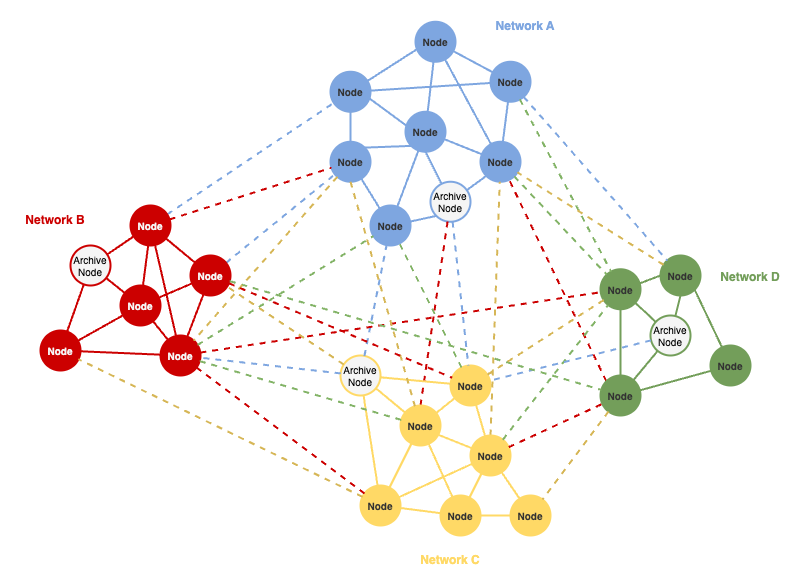

# Decentralized Messaging Engine

This document describes a solution for cross networks communication, including oracle, offchain computation or blockchain networks.

## Links

- [Threat Analysis](./THREAT_ANALYSIS.md)
- [Appendix: Libp2p](./APPENDIX_LIBP2P.md)
- Examples:
    - [OCR based cryptography](https://github.com/amirylm/p2pmq/tree/main/examples/don) (Chainlink Oracles)
    - [BLS based networks](https://github.com/amirylm/p2pmq/tree/main/examples/bls)

## Table of Contents

- [Overview](#overview)
    - [Goals](#goals)
    - [Background: Libp2p](#background-libp2p)
- [High Level Design](#high-level-design)
    - [Technical Overview](#technical-overview)
    - [Architecture](#architecture)
    - [API](#api)
    - [Network Topology](#network-topology)
    - [Message Validation](#message-validation)

## Overview

By introducing a decentralized messaging engine (DME) that enables to securely exchange verifiable messages cross networks, we enable the formation of a global, collaborative network that is consist of multiple overlay networks.

The protocol leverages libp2p and gossipsub v1.1 for robust networking and message propagation while ensuring the integrity and authenticity of transmitted data through an outsourced cryptographic and sequence validation.

The following diagrams visualize the topology of a global network,
where the dashed lines represent overlay networks, and the solid lines represent the underlying/standalone networks:



### Goals

- Enable secure communication layer cross networks
- Enable validation and authentication exchanged messages via outsourced verification
- Utilize libp2p and gossipsub for efficient networking and message propagation
- Provide a flexible/extensible API for various use cases, while maintaining a simple and robust protocol that can manage scale and high throughput

### Background: Libp2p

Libp2p is a modular networking framework designed for peer-to-peer communication in decentralized systems. It provides a foundation for building decentralized applications and systems by offering a range of essential components. Among its core features are [pubsub](./APPENDIX_LIBP2P.md#pubsub), [peer discovery](./APPENDIX_LIBP2P.md#kad-dht), abstracted transport layer and a complete [cryptography suite](./APPENDIX_LIBP2P.md#security).

[gossipsub v1.1](https://github.com/libp2p/specs/blob/master/pubsub/gossipsub/gossipsub-v1.1.md) is a dynamic and efficient message propagation protocol, it is based on randomized topic meshes and gossip, with moderate amplification factors and good scaling properties.

Gossipsub is designed to be extensible by more specialized routers, and provides an optimized environment for a distributed protocol that runs over a trust-less p2p network.

Libp2p was chosen because it provides a battle tested, complete yet extensible networking framework for a distributed message engine.

**NOTE:** For more information see the [libp2p appendix](./APPENDIX_LIBP2P.md).

## High Level Design

### Technical Overview

Agents runs within some parent node, and enables the node to gossip messages in an overlay network (topic), with an outsourced message validation to avoid introducing additional dependencies for the agent such as validation keys.

Sending verified-only information enables to achieve optimal latency and throughput because there is no additional signing involved. In addition, consensus is not needed for sharing a sequential, signed-by-quorum data, which is usually stored on-chain or some public storage.

Message validation is decoupled from the agent, which queues messages for validation and processing, and enables to implement a custom validation logic according to each network needs.

Based on validation results, message rate and overall behaviour, peer scoring is being facilitated by the pubsub router, but requires network specific settings to fit the topology, expected message rate and the strictness of the needed validation.

### Architecture

Agents are separate processes running within some parent node, interacting with the parent node via a gRPC API, following [go-plugin](https://github.com/hashicorp/go-plugin) for achieving a modular architecture. 

The following diagram visualize the system:


Agents manages libp2p components such as the gossipsub router, which is responsible for message propagation and peer scoring. In addition, the following services runs within the agent:

- **validation router** for message validation and processing
- **message router** for consuming messages
- **control service** for managing subscriptions, publishing messages and more.

The node implements verifiers for validating messages, and processors for processing incoming messages from other networks, and broadcasting messages on behalf of the node to other networks.

### API

The following gRPC services are used by the clients from within the parent node, for interacting with the agent:

```protobuf
service ControlService {
    rpc Publish(PublishRequest) returns (PublishResponse); 
    rpc Subscribe(SubscribeRequest) returns (SubscribeResponse);
    rpc Unsubscribe(UnsubscribeRequest) returns (UnsubscribeResponse);
}

service MsgRouter { 
    rpc Listen(ListenRequest) returns (stream Message) {}
}

service ValidationRouter { 
    rpc Handle(stream Message) returns (stream ValidatedMessage) {}
}
```

### Network Topology

Each network creates an overlay network for outbound traffic (i.e. pubsub topic), where other networks can subscribe for messages.

There might be multiple overlay networks for broadcasting messages from the same network, depends on versioning and business logic.
For instance, in case the encoding of the messages has changed, a new overlay network will be created for the new version, and the old overlay network will be neglected until it is no longer needed or used.

The amount of overlay connections to nodes in other networks might be changed dynamically, depends on the network topology and the amount of nodes in each network.
Gossipsub allows to configure the amount of peers per topic, while having decent propagation of messages. That property enables to scale the global network to a large amount of nodes, w/o flooding the wires and consuming too much resources.

### Message Validation

As the validation is outsourced the parent node, we rely on the security properties of an existing nodes and infrastructure for signing and verifying messages.

**NOTE:** Having validation within the agent introduces complexity and vulnerabilities.

All the messages are propagated through the pipes must be valid.
In case of invalid messages, the message will be dropped and the sender, regardless of the message origin, will be penalized by the gossipsub router.

E.g. for an oracle (or other offchain computing) network, messages must comply with the following strict rules:

- The message was **signed by a quorum** of a standalone-network nodes
- The message has a **sequence number** that match the current order, taking into account potential gaps that might be created due to bad network conditions.
    - Messages that are older than **Validity Threshold** (value TBD) are considered invalid and will result in a low score for the sender, either the origin peer or a gossiper peer
    - Messages that are older than **Skip Threshold** (value TBD) will be ignored w/o affecting sender scores
