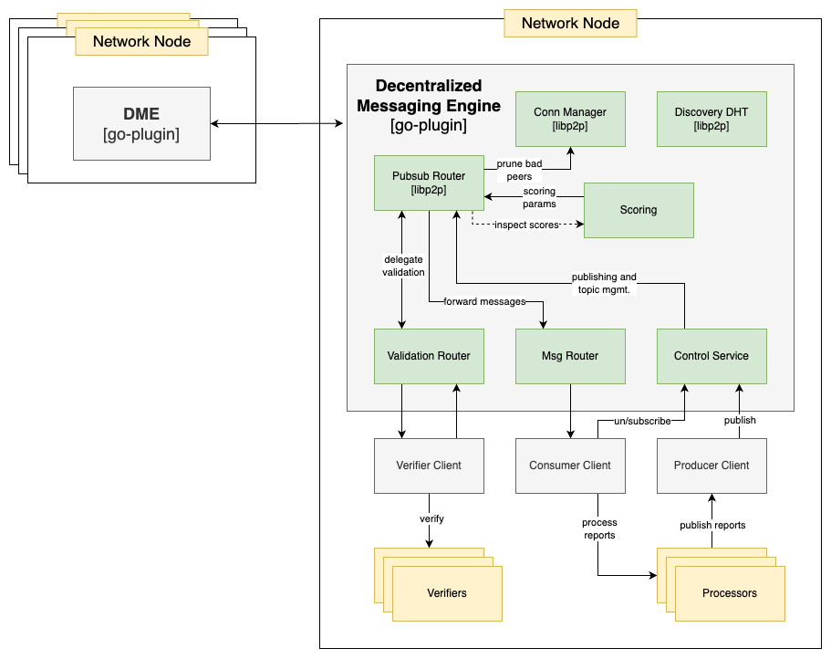

# PMQ 

<br />

**WARNING: This is an experimental work in progress, DO NOT USE in production**

<br />

This document describes a solution for cross networks communication, including oracle, offchain computation or blockchain networks.

## Links

- [Threat Analysis](./THREAT_ANALYSIS.md)
- [Appendix: Libp2p](./APPENDIX_LIBP2P.md)
- Examples:
    - [OCR based cryptography](https://github.com/amirylm/p2pmq/tree/main/examples/don) (Chainlink Oracles)
    - [BLS based networks](https://github.com/amirylm/p2pmq/tree/main/examples/bls)

## Table of Contents

- [Overview](#overview)
    - [Goals](#goals)
    - [Background: Libp2p](#background-libp2p)
- [High Level Design](#high-level-design)
    - [Technical Overview](#technical-overview)
    - [Architecture](#architecture)
    - [API](#api)
    - [Network Topology](#network-topology)
    - [Message Validation](#message-validation)

## Overview

By introducing a decentralized messaging engine that facilitates the secure exchange of verifiable messages across networks, we enable the formation of a global, collaborative network that consists of multiple overlay networks.

The resulting protocol leverages libp2p and gossipsub v1.1 in order to provide robust networking and message propagation while ensuring the integrity and authenticity of transmitted data by outsourcing the process of cryptographic and sequence validation.

The following diagram visualizes the topology of a such a global network,
where the dashed lines represent overlay networks and the solid lines represent the underlying/standalone networks:


### Goals

- Enable secure communication layer across networks
- Enable exchange of messages while facilitating validation and authentication via an outsourced verification mechanism
- Provie efficient and reliable network communication and message propagation by utilizing proven protocols such as gossipsub
- Provide a flexible & extensible API that serves an array of use cases, while maintaining a simple and robust protocol that can withstand scaling and high throughput

### Background: Libp2p

Libp2p is a modular networking framework designed for peer-to-peer communication in decentralized systems. It provides a foundation for building decentralized applications and systems by offering a range of essential components. Among its core features are [pubsub](./APPENDIX_LIBP2P.md#pubsub), [peer discovery](./APPENDIX_LIBP2P.md#kad-dht), abstracted transport layer and a complete [cryptography suite](./APPENDIX_LIBP2P.md#security).

[gossipsub v1.1](https://github.com/libp2p/specs/blob/master/pubsub/gossipsub/gossipsub-v1.1.md) is a dynamic and efficient message propagation protocol, it is based on randomized topic meshes and gossip, with moderate amplification factors and good scaling properties.

Gossipsub is designed to be extensible by more specialized routers and provides an optimized environment for a distributed protocol that runs over a trust-less p2p network.

Libp2p was chosen because it provides a battle tested, complete yet extensible networking framework for a distributed message engine.

**NOTE:** For more information see the [libp2p appendix](./APPENDIX_LIBP2P.md).

## High Level Design

### Technical Overview

Agents runs within some parent nodes, and enables the node to gossip messages in an overlay network (topic), while using an outsourced message validation to avoid introducing additional dependencies for the agent such as requiring validation keys.

Sending verified-only information enables to achieve optimal latency and throughput due to having no additional signing involved. Additionally, consensus is not needed for sharing a sequential, signed-by-quorum data, which is usually stored on-chain or some public storage.

Message validation is decoupled from the agents, which queue messages for validation and processing, thus enabling the implementation of any specifically tailored, custom validation logic according to each network requirements.

Peer scoring is facilitated by the pubsub router according to validation results, messaging rate and overall behaviour, however it is still required that network specific setting fit the topology, expected message rate and the strictness of the validation requirements.

### Architecture

Agents are separate processes running within some parent node, interaction is done via a gRPC API, following [go-plugin](https://github.com/hashicorp/go-plugin) in order to achieve modularity.

The following diagram illustrates the system architecture:



Agents manages libp2p components such as the gossipsub router, which is responsible for message propagation and peer scoring. Additionally, the following services run within the agent:

- **validation router** for message validation and processing
- **message router** for consuming messages
- **control service** for managing subscriptions, publishing messages and more.

The node implements:
- verifiers for validating messages
- processors for processing incoming messages from other networks, and broadcasting messages on behalf of the node to other networks.

### API

The following gRPC services are used by the clients from within the parent node, for interacting with the agent:

```protobuf
service ControlService {
    rpc Publish(PublishRequest) returns (PublishResponse); 
    rpc Subscribe(SubscribeRequest) returns (SubscribeResponse);
    rpc Unsubscribe(UnsubscribeRequest) returns (UnsubscribeResponse);
}

service MsgRouter { 
    rpc Listen(ListenRequest) returns (stream Message) {}
}

service ValidationRouter { 
    rpc Handle(stream Message) returns (stream ValidatedMessage) {}
}
```

### Network Topology

Each network creates an overlay network for outbound traffic (i.e. pubsub topic), where other networks can subscribe for messages.

There might be multiple overlay networks for broadcasting messages from the same network, depending on versioning and business logic.
For instance, in case the encoding of the messages has changed, a new overlay network will be created for the new version and the old overlay network will be neglected until it is no longer needed or used.

The amount of overlay connections to nodes in other networks might be changed dynamically, depending on the network topology and the amount of nodes in each network. Gossipsub allows to configure the amount of peers per topic while facilitating decent propagation of messages. This property enables the scale of the global network to a large quantity of nodes w/o flooding the wires and consuming too much resources.

### Message Validation

Due to the validation being outsourced to the parent node, we rely on the security properties of an existing infrastructure for the processes of signing and verifying messages.

**NOTE:** Having validation within the agent introduces significant complexity, dependencies and aaditional vulnerabilities.

All the messages are propagated through the pipes must be valid.
In case of invalid messages, the message will be dropped and the sender, regardless of the message origin, will be penalized by the gossipsub router.

E.g. for an oracles (or other offchain computing) network, messages must comply with the following strict rules:

- The message was **signed by a quorum** of a standalone-network nodes
- The message has a **sequence number** that match the current order, taking into account potential gaps that might be created due to bad network conditions.
    - Messages that are older than **Validity Threshold** are considered invalid and will result in a low score for the sender, which can be either the origin peer or a gossiper peer
    - Messages that are older than **Skip Threshold** will be ignored w/o affecting sender scores

**NOTE:** validity and skip thresholds should be set within the parent node, according to the network topology and expected message rate.
